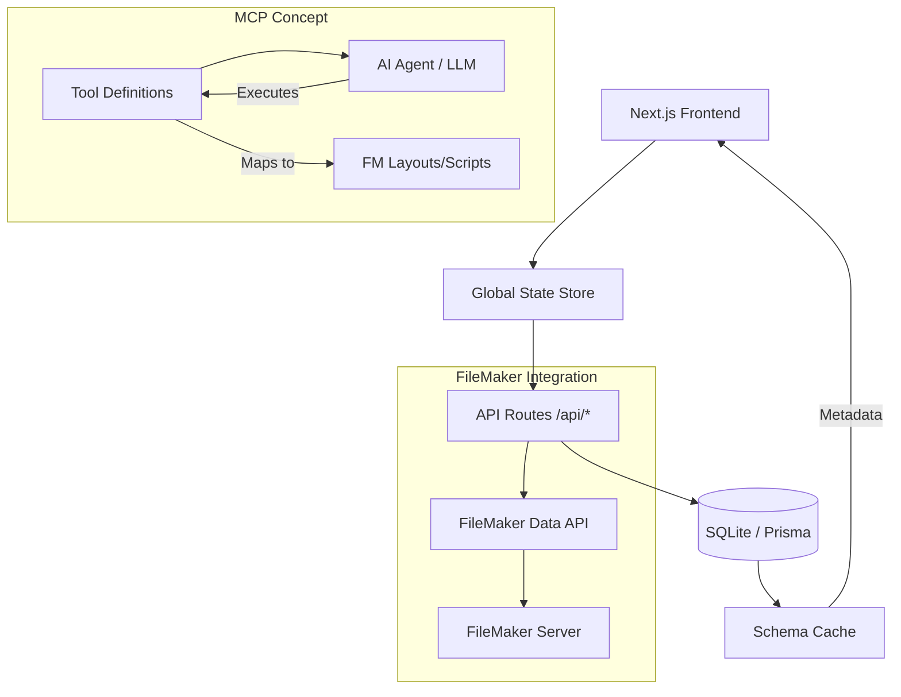

# FileMaker MCP Platform Documentation

This application is a comprehensive management platform designed to bridge **Claris FileMaker** databases with the **Model Context Protocol (MCP)**. It allows developers to create, manage, and deploy MCP servers that expose FileMaker data and scripts as AI-consumable tools.

## 🚀 Overview

The platform provides a centralized interface for defining how AI models interact with FileMaker databases. By wrapping the FileMaker Data API into standard MCP tools, it enables LLMs to perform CRUD operations, run scripts, and search records within FileMaker systems safely and efficiently.

## 📐 Architecture Diagram

---

## 🏗️ Technical Stack

- **Core Framework**: [Next.js 15](https://nextjs.org/) (App Router & Turbopack)
- **Database**: [SQLite](https://www.sqlite.org/) with [Prisma ORM](https://www.prisma.io/)
- **UI Architecture**: [Tailwind CSS](https://tailwindcss.com/) + [Shadcn UI](https://ui.shadcn.com/)
- **State Management**: [Zustand](https://docs.pmnd.rs/zustand/getting-started/introduction) (with Persistence)
- **Data Fetching**: [TanStack Query v5](https://tanstack.com/query/latest)
- **Form Handling**: [React Hook Form](https://react-hook-form.com/) + [Zod](https://zod.dev/)

---

## 🔑 Key Modules

### 1. FileMaker Connections
Managed under `/connections`, this module handles the secure storage of FileMaker Server credentials.
- **Connection Health**: Periodically tests connections and logs errors.
- **SSL Management**: Toggleable SSL verification for development environments.
- **Multiple Auth Types**: Supports Basic, OAuth, and Claris ID.

### 2. Schema Caching Engine
Located in `src/app/api/connections/[id]/schema`, this engine extracts metadata from FileMaker to power the tool builder:
- **Layout Discovery**: Fetches record counts and field availability.
- **Script Discovery**: Lists all accessible scripts for automation.
- **Relationship Graph**: Understands table occurrences and key matches.

### 3. MCP Server Management
Servers act as the "containers" for your tools.
- **Staging vs. Production**: Toggle between environments.
- **Branching (Git-like)**: Develop new features in a branch (e.g., `feature-billing-tools`) and merge them into `main`.
- **Server Config JSON**: Real-time preview of the generated MCP configuration.

### 4. Tool Builder & Playground
The heart of the application:
- **Input Schema Generation**: Automatically creates JSON schemas for tool inputs based on FileMaker field types.
- **Handler Configuration**: Define how tool parameters map to FileMaker Layout fields or Script parameters.
- **Live Playground**: Test tools directly within the app. Features include:
    - **Auto-generated Forms**: UI forms built on-the-fly from JSON schemas.
    - **Response Inspector**: View status codes, execution duration, and full JSON payloads.
    - **Execution History**: Replay previous requests and compare results.

### 5. Deployment Lifecycle
Track every version of your MCP server.
- **Snapshots**: Each deployment captures the exact state of all tools and configurations.
- **Changelogs**: Document what changed in each version.
- **Rollbacks**: Quickly revert to a previous stable deployment if an error is discovered.

---

## 📂 File Structure Highlights

- `src/app/page.tsx`: The main "View Router" that handles SPA-like navigation between modules.
- `src/lib/store.ts`: The central source of truth for navigation, dialog states, and current selections.
- `prisma/schema.prisma`: Defines the relationship between Connections, Servers, Branches, and Tools.
- `src/components/ui`: A rich collection of reusable Shadcn components.

---

## 🛠️ Developer Workflow

1.  **Add Connection**: Input your FileMaker Server details.
2.  **Create Server**: Define a new MCP server (e.g., "Customer Service Agent").
3.  **Define Tools**: Map a FileMaker layout (e.g., "Contacts") to a tool (e.g., `search_customers`).
4.  **Test in Playground**: Ensure the tool returns the expected data.
5.  **Deploy**: Snapshot the configuration and mark it as 'Deployed'.

---

## 🔮 Roadmap

- **Claris Connect Integration**: Trigger flows directly from MCP tools.
- **Advanced Find Handler**: Visual builder for complex FileMaker find requests.
- **Python/Node Proxy**: Standalone bridge to run the MCP server outside of the management UI.
- **AI-Generated Tools**: Automatically suggest tools by analyzing your FileMaker layout usage patterns.
